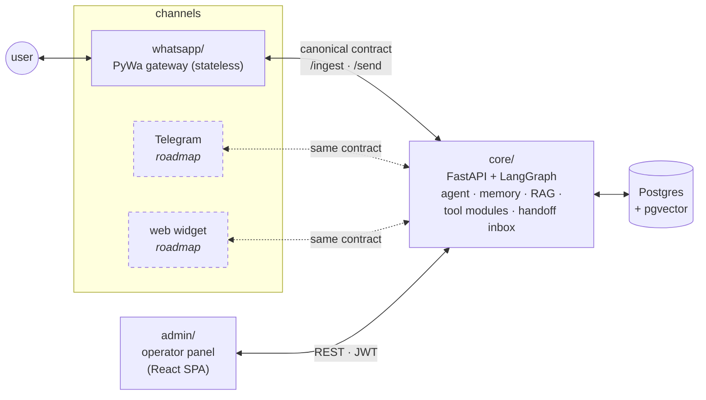

<div align="center">


**Open-source stack for building custom AI chat agents — self-hosted, channel-agnostic, production-minded.**

WhatsApp today · Telegram and web widget on the roadmap

[](https://pypi.org/project/chasqui/)
[](./LICENSE)

</div>

```bash
uvx chasqui new my-agent
```

One command, one wizard, and you have a running AI agent: a single
conversation thread per contact, long-term memory, an FAQ knowledge base with
RAG (grounded answers, no hallucinations), **multimodal in and out** (images,
documents, voice notes), a **human handoff inbox** where operators take over
and reply from the panel, lead capture, and a pluggable tool/module system
where you build each company's differentiating logic. The LLM is a `.env`
swap: Gemini, Claude, GPT, OpenRouter or local Ollama.

> Named after the *chasqui* — the relay messengers of the Inca empire who
> carried messages across the network.

Chasqui is opinionated on purpose: the plumbing decisions are already made —
PostgreSQL + pgvector, one canonical message contract between services,
conventions over configuration — so your energy goes into your agent's
logic, not into infrastructure. Every non-obvious decision is written down
as an ADR in [`docs/design/`](./docs/design/).

## Quickstart

Prerequisites: [`uv`](https://docs.astral.sh/uv/), Node 22, and a PostgreSQL
with the pgvector extension (or use the generated docker-compose). For the
WhatsApp channel you'll want a free Meta developer app — step-by-step:
[`docs/WHATSAPP-SETUP.md`](./docs/WHATSAPP-SETUP.md).

```bash
uvx chasqui new my-agent      # the wizard asks: LLM, embeddings, where's
cd my-agent                   # your Postgres, ports, WhatsApp creds
                              # (skippable), language, first admin — then
                              # provisions everything (deps, db, migrations)

cd core && make dev           # API on :8090
cd whatsapp && make dev       # WhatsApp gateway on :8000
cd admin && npm run dev       # operator panel on http://localhost:5191
```

Nothing the wizard wrote is locked in: it all lives in each service's `.env`
(the LLM swap applies on the next message — no redeploy). The one
provision-time choice is `EMBEDDING_DIM`, baked into the schema by the first
migrate ([ADR-001](./docs/design/adr-001-embeddings-provider-dims.md)).

To hack on the stack itself instead, clone this repo with
`--recurse-submodules` and follow each service's README;
`docker compose up` brings up Postgres + core + admin in one command.

## Architecture: a channel-agnostic core

The core **never knows a channel exists**. Channels are thin, stateless
gateways that translate their platform to one canonical message contract —
two endpoints (`POST /ingest` in, `POST /send` out) and you've added a
channel. Silence, human handoff, media, delivery errors: all expressed in
the contract once, inherited by every channel for free.



| Repo | Stack | Role |
|------|-------|------|
| [`core`](https://github.com/chasqui-stack/core) | FastAPI · LangGraph · SQLModel · Postgres/pgvector | The conversation engine: ingest, agent, memory, RAG, tool registry, handoff inbox, admin auth |
| [`whatsapp`](https://github.com/chasqui-stack/whatsapp) | PyWa 4.x (BSUID-first) · FastAPI | WhatsApp channel gateway — the first of many |
| [`admin`](https://github.com/chasqui-stack/admin) | React 19 · Vite · Tailwind · shadcn/ui | Operator panel: prompts, FAQ, tools, conversations, inbox, leads |
| [`cli`](https://github.com/chasqui-stack/cli) | typer · PyPI `chasqui` | `chasqui new` / `chasqui generate module` |

Full design: **[`docs/ARCHITECTURE.md`](./docs/ARCHITECTURE.md)**.

## Roadmap

- **Telegram channel** — a second gateway speaking the same contract.
- **Web chat widget** — embeddable channel for any website.
- **Analytics** — conversation stats module for the panel.
- **Document RAG** — knowledge base beyond FAQ pairs (PDFs, docs).

Issues and ideas welcome — open them in the repo they belong to.

## Extending it

Capabilities are **Tool Modules**: self-contained packages the core
auto-discovers, each contributing tools (with their prompt in the
docstring), optional tables, admin routes, and config knobs that the panel
auto-renders as a form — zero frontend work.

```bash
chasqui generate module price_check --with-models --with-admin
```

Guide: [`docs/MODULES.md`](./docs/MODULES.md).

## Deploying

Kamal 2, three services, auto-TLS — guide: [`docs/DEPLOY.md`](./docs/DEPLOY.md).

## Contributing

See [`CONTRIBUTING.md`](./CONTRIBUTING.md).

## License

[Apache-2.0](./LICENSE).
