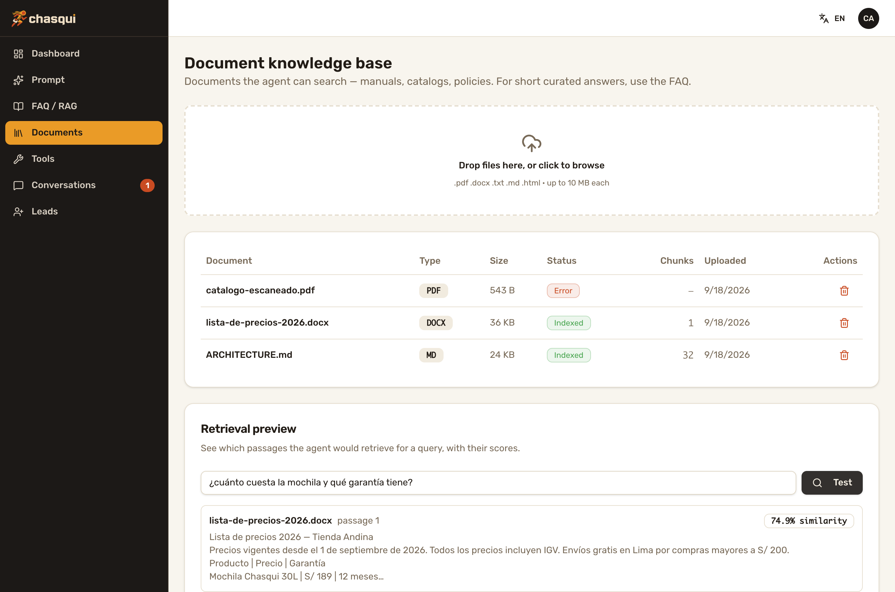
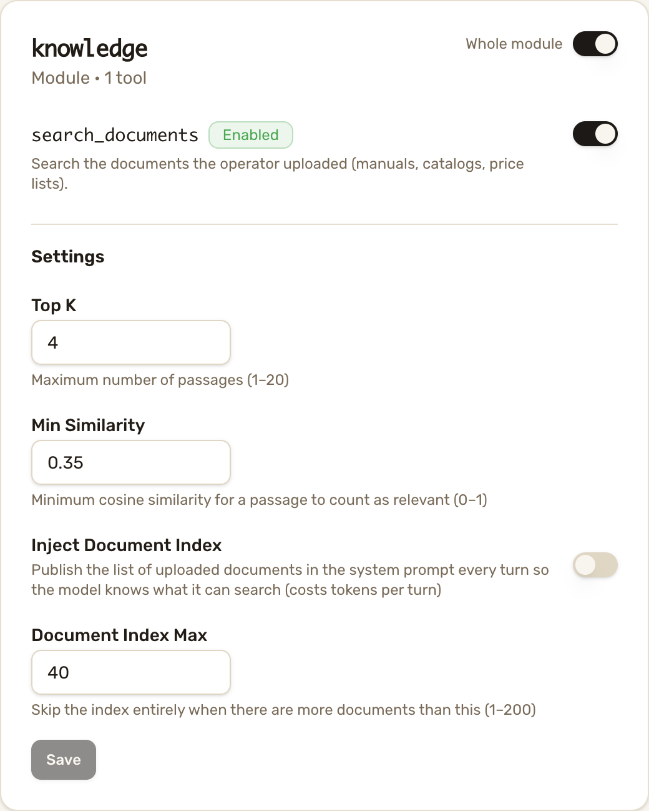

# Writing a Tool Module

Tool Modules are **the** extension point of Chasqui (ARCHITECTURE §8): every
capability you add to an agent — price lookups, booking, CRM sync — is a
self-contained package under `core/app/modules/` that the core discovers at
startup. You never edit the core.

Reference implementations, in increasing order of surface:

- [`core/app/modules/memory/`](https://github.com/chasqui-stack/core/tree/main/app/modules/memory) — tools + a prompt fragment (retrieved facts)
- [`core/app/modules/faq/`](https://github.com/chasqui-stack/core/tree/main/app/modules/faq) — tools + table + admin routes + config (**read this one first**)
- [`core/app/modules/handoff/`](https://github.com/chasqui-stack/core/tree/main/app/modules/handoff) — conversation-state side effects + notifications
- [`core/app/modules/knowledge/`](https://github.com/chasqui-stack/core/tree/main/app/modules/knowledge) — the second full-contract module (Document-RAG, [ADR-013](./design/adr-013-document-rag.md)): **multipart upload**, **background processing with a status column** (`pending → processing → ready | error`, stale-job takeover, never-raising job with its own session) and a tool that coexists with a similar one

## Scaffold

```bash
chasqui generate module price_check                # tools + config + test
chasqui generate module price_check --with-models  # + SQLModel table
chasqui generate module price_check --with-admin   # + /admin/modules/price_check routes
```

## The contract

A module is a package exposing a module-level `module` attribute:

```python
class PriceCheckModule:
    name = "price_check"
    config_key = "price_check"            # where knobs live in agent_config.tool_config

    def register_tools(self):             # required
        return [price_check]

    def register_models(self):            # optional — module-owned tables
        return [PriceRecord]

    def register_admin_routes(self, router):   # optional — /admin/modules/<name>/*
        register(router)

    def config_schema(self):              # optional — admin-editable knobs
        return PriceCheckConfig

    async def system_prompt_fragment(self, context, query):  # optional — per-turn
        return None                       # prompt block (ADR-012), None = silent

module = PriceCheckModule()
```

Drop the package in `core/app/modules/` and restart — discovery is
automatic. Operators enable/disable each tool at runtime in the panel
(`/tools`); no deploy involved.

## Tools: the docstring IS the prompt

Tools are LangChain `@tool` functions receiving `ToolRuntime[TurnContext]`:

```python
@tool
async def price_check(product: str, runtime: ToolRuntime[TurnContext]) -> str:
    """Look up the current price of a product in the catalog.

    Use this whenever the user asks what something costs. Args:
        product: The product name as the user said it.
    """
    ctx = runtime.context        # ctx.session (AsyncSession), ctx.contact,
    ...                          # ctx.conversation, ctx.config
```

Rules that bite if ignored:

- **The docstring is what the LLM reads** to decide when to call you —
  write it for the model, in English (the system prompt localizes replies).
- **Return serializable data** (a string is best). Tool exceptions become
  error `ToolMessage`s automatically — don't catch-and-hide.
- A tool that needs more user data returns *instructions to ask for it*
  (see `lead_capture`'s "Lead NOT saved yet — missing: email" loop) — the
  model relays the question and calls again.

## Config knobs: a form for free

`config_schema()` returns a Pydantic model. Its JSON Schema drives an
auto-rendered form in the panel (`/tools`), and operators' values arrive in
`agent_config.tool_config[config_key]`:

```python
class PriceCheckConfig(BaseModel):
    currency: str = Field(default="USD", description="ISO code shown to users")
    max_results: int = Field(default=3, ge=1, le=10)
```

- **Keep it FLAT** — str/int/float/bool only. Nested objects don't render.
- Parse defensively at call time (bad admin input must not break a turn) —
  copy the `_tool_config()` helper from the scaffold/faq.
- The core validates panel writes against your schema (422 on violations).

## System-prompt fragments

`system_prompt_fragment(context, query)` (async, optional) lets a module
append one block to the system prompt **every turn** —
[ADR-012](./design/adr-012-module-prompt-fragments.md). `context` is the
turn's `TurnContext`; `query` is the inbound text. Return `None` to stay
silent. A raising hook is logged and skipped — it never breaks the turn.

Live examples: `memory` publishes the retrieved facts block; `faq` publishes
its question index behind the `inject_question_index` knob and `knowledge`
its list of searchable filenames behind `inject_document_index` (both
default off).

Rules that bite:

- **It runs on every turn.** Keep it cheap; anything injected is a per-turn
  token cost the operator pays forever — make expensive fragments opt-in via
  `config_schema()` knobs, like `faq` does.
- **Framing matters:** describe content as *look-up-able* ("call `x_tool`
  for these"), never as knowledge the model already has — that wording makes
  models skip the tool and answer from priors (the bug that motivated the
  hook, chasqui#30).
- English only, like every LLM-facing string.

## When two tools overlap

`faq_search` (curated Q&A) and `search_documents` (uploaded files) are close
enough that a model can pick the wrong one — or stop after the first miss
while the answer sits in the other store. The pattern that fixed it
([ADR-013](./design/adr-013-document-rag.md), measured with a routing eval),
reusable whenever your module ships a tool similar to an existing one:

- **Descriptions route.** Each docstring names its own territory *and the
  sibling's* ("for X use `other_tool` instead; when unsure, call both").
  Avoid catch-all claims ("ANY question…") — they win every first pick. Keep
  the first docstring line a complete sentence: the Tools page shows only it.
- **Results hand over.** On a miss — and on hits, which can be near-misses —
  end the return with "if you have not already, call `other_tool` before
  replying". Guard it with `registry.has_tool()` + `tool_enabled()`: never
  point at a tool the model can't call.
- **Never route from the system prompt** — it's operator-owned and editable.
- **Return whole retrieval units.** Truncating passages to save tokens drops
  the answer whenever it sits past the cut.
- Docstrings and return strings are prompts: **re-run an eval against the
  real LLM** when you touch them (5 questions per side over disjoint data is
  enough to see a regression).

<p align="center">
  
  
</p>

## Tables and migrations

`register_models()` returns SQLModel classes; the registry imports them into
metadata for Alembic and the test suite. After defining a model:

```bash
cd core && make makemigrations m="add price_check tables" && make migrate
```

Embedding columns must use `EMBEDDING_DIM`-aware code — never hardcode a
dimension, and build cosine queries with `app/core/vector_search.py`
(ADR-001: at >2000 dims a mismatched expression silently seq-scans).

## Admin routes

`register_admin_routes(router)` mounts under `/admin/modules/<name>` —
already JWT-protected. Convention: list endpoints return the
`{items, total}` envelope with `limit`/`offset` (see `faq/admin.py`,
`handoff/admin.py`). The panel side is yours to add — or consume it from
anywhere else; it's just REST.

## Testing

The scaffold ships a contract test. For behavior, follow
`core/tests/modules/`: call the tool's coroutine directly with a stub
runtime —

```python
result = await price_check.coroutine(
    product="router",
    runtime=SimpleNamespace(context=TurnContext(session=session, ...)),
)
```

DB tests ride the transactional-rollback fixtures in `tests/conftest.py`
(nothing commits; don't write cleanup logic). LLM-in-the-loop tests use the
ScriptedModel pattern (`tests/`) — no network, ever.

## Checklist before you ship

- [ ] English-only: code, docstrings, tool returns, log lines.
- [ ] Tool returns are strings/serializable; no exceptions for control flow.
- [ ] Config schema flat; tool parses it defensively.
- [ ] Migration generated and reversible; vector queries via `vector_search`.
- [ ] Tests: contract + behavior (and ScriptedModel if the tool shapes the
      conversation).
- [ ] No business logic outside the module; no edits to the core.
