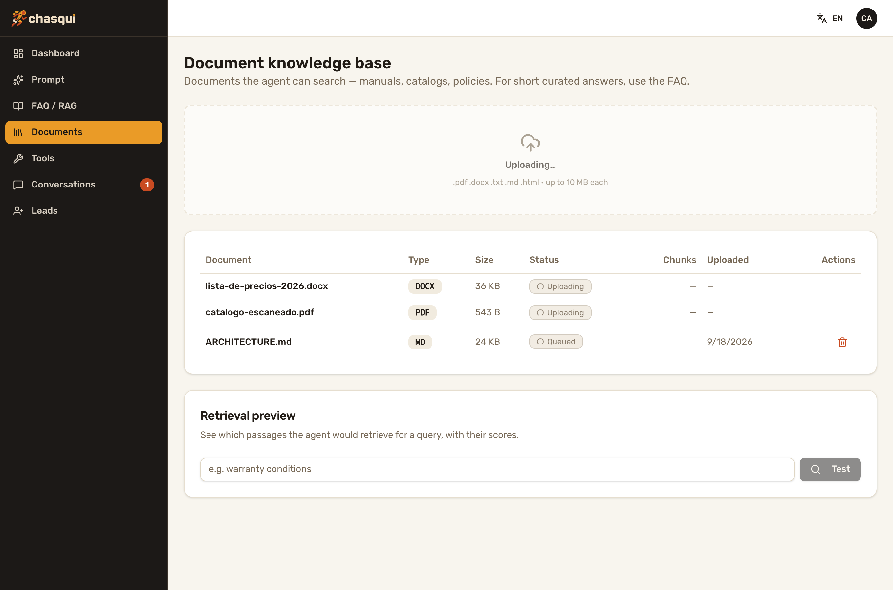

# ADR-013 — Document-RAG: the `knowledge` module and the two-retriever boundary

**Status:** Accepted — 2026-09-18
**Sprint:** 15
**Related:** [ARCHITECTURE §8](../ARCHITECTURE.md) (module contract), [MODULES.md](../MODULES.md), [ADR-001](./adr-001-embeddings-provider-dims.md) (dim-aware vectors the module obeys), [ADR-002](./adr-002-postgres-only.md) (Postgres is identity), [ADR-003](./adr-003-media-storage.md) (the optional bucket this module does *not* depend on), [ADR-008](./adr-008-deferred-dispatch-coalescing.md) (the one Postgres worker — coalescing-specific), [ADR-012](./adr-012-module-prompt-fragments.md) (prompt fragments; decision 4 there is amended here), epic [chasqui#28](https://github.com/chasqui-stack/chasqui/issues/28) (core#15, core#16, admin#8, core#17)

## Context

FAQ-RAG answers curated question/answer pairs, but businesses keep most of
what they know in **files**: price lists, product manuals, policies,
contracts. Retyping a 20-page manual as FAQ entries is not something an
operator will do. "Document RAG" sat in the post-MVP backlog since Sprint 4.

Forces:

- **It must work on every install.** Object storage (ADR-003) is optional; a
  feature that needs a bucket is a feature half the installs don't have.
- **No job infrastructure exists.** The only background worker in the stack
  (ADR-008) is welded to inbound coalescing — there is no generic queue.
- **Two similar retrievers in one agent is the known risk.** `faq_search` and
  a documents tool are semantically adjacent; a model that picks the wrong one
  — or stops after the first miss — answers "I don't know" while the answer
  sits in the other store.
- Review surface stays Jr-friendly: light dependencies, no new services.

## Decision

1. **A built-in `knowledge` module** (`core/app/modules/knowledge/`), shipped
   next to `faq` and auto-discovered like any module. It uses the whole
   contract — tables, admin routes, a tool, config knobs, a prompt fragment —
   and adds two patterns `faq` doesn't show: **multipart upload** and
   **background processing with a status column**.

2. **Extracted text lives in Postgres; the original file is discarded.**
   `documents.content_text` holds what extraction produced;
   `content_sha256` (unique) rejects re-uploads of the same bytes with 409.
   Reprocessing (re-chunk + re-embed, e.g. after an embeddings outage or a
   provider change) starts from the stored text — no bucket required.

3. **Formats: pdf, docx, txt, md, html** via light pure-Python deps (`pypdf`,
   `python-docx`, `beautifulsoup4`). docx is walked in document order so
   tables stay where the author put them (rows joined with ` | `). Type is
   validated by extension + MIME; uploads are capped at **10 MB** by reading
   `limit + 1` bytes (Content-Length can lie). A file with no extractable
   text (a scanned PDF) ends in `error` with a clear message — no OCR.

4. **Chunking is omakase constants, not knobs:**
   `RecursiveCharacterTextSplitter`, **1200 chars / 180 overlap** (markdown
   splits on headings and fences first). Changing them invalidates every
   stored vector, so they are code, and `reprocess` is the migration path.
   **One batched embeddings call per document** — per-chunk calls burn rate
   limits. A partial batch is an error: a document is `ready` only with all
   its chunks *and* vectors, never half-indexed.

5. **Processing = FastAPI `BackgroundTasks` + `documents.status`**
   (`pending → processing → ready | error`). The upload commits the row,
   returns **202**, and the job opens its own session. The job never raises:
   every failure lands in the row (`error_detail`). Because nothing resumes a
   job after a crash, a row stuck in `pending`/`processing` for more than
   **10 minutes** (`STALE_AFTER`) is presumed dead and `reprocess` may take it
   over; before that, reprocess answers 409. `can_reprocess` in the API is
   simply "there is stored text" — a scanned PDF has none, so the panel
   doesn't offer a button that can only fail.

6. **Separate `document_chunks` table** (FK cascade, HNSW index through
   `vector_search.hnsw_index_ddl`, ADR-001), not a shared table with
   `faq_entries`. Search joins to `documents` and only sees `ready` ones; an
   embeddings outage degrades to "no hits", never a 500 or a broken turn.

7. **`search_documents` tool**, knobs under
   `tool_config["document_search"]`: `top_k = 4`, `min_similarity = 0.35`
   (raw chunks score lower than curated Q&A, hence below faq's 0.5). It
   returns **whole chunks** prefixed with `[filename]` plus a grounding
   instruction. An earlier draft capped passages at ~600 chars; the routing
   eval showed the cut drops the answer whenever it sits in the second half
   of a chunk (a warranty procedure starting at char 462 of 1162). Chunks
   are already bounded by decision 4; four of them cost ≈1.2K tokens.

8. **The two-retriever boundary is carried by tool text, in two layers — no
   system-prompt routing:**

   - **Docstrings are the router.** Each tool names its own territory *and
     the other tool's*: `faq_search` = general questions about the business
     (schedules, location, contact, payments, shipping, policies, concepts);
     `search_documents` = anything a file would hold (a product's price,
     specs, warranty, care instructions, procedures, detailed terms); "when
     unsure, call both". **This amends ADR-012 decision 4:** the "Call this
     for ANY question … prices … how-tos" wording claimed the documents'
     territory and won the first pick. What ADR-012 actually needed survives
     verbatim — *"You do NOT know these details from training … Answer ONLY
     with what the tool returns."* The first docstring line must be a
     complete sentence: the admin Tools page shows only that line.
   - **Returns are the safety net.** A miss *and* a hit (hits can be
     near-misses: similar wording, different topic) end with a pointer to the
     sibling — "if you have not already, call `<sibling>` with the same query
     before replying; only if that also finds nothing, tell the user you
     don't have it". The pointer appears **only while the sibling is
     registered and enabled** (`registry.has_tool()` + `tool_enabled()`);
     otherwise the original final miss is returned. A tool never advertises
     one the model cannot call.

9. **Opt-in document index** (`inject_document_index`, default **off**;
   `document_index_max = 40`): the filenames of `ready` documents as a prompt
   fragment — the exact ADR-012 contract of faq's question index (capped,
   warn-once, nothing over the cap, silent while the tool is disabled,
   framed as "files you can SEARCH, not things you know").

10. **Admin page `/knowledge`** ("Documents" in the nav; "Document knowledge
    base" as title, so it doesn't collide with FAQ's): multi-file drop zone,
    client-side mirror of the type/size rules, the core's English errors
    mapped to i18n keys by HTTP status, a retrieval preview with similarity
    scores (the tool for tuning `min_similarity`), and **conditional
    polling** — the list refetches only while something is in flight, never
    eternally. The knobs need no admin code: `SchemaForm` renders them.

  

### Evidence — the routing eval

Real LLM (`gemini-2.5-flash`) and real embeddings; 5 FAQs + a product manual
and a price list with disjoint content (plus an unrelated document as noise);
5 FAQ-only and 5 docs-only questions, each a fresh conversation through the
real agent graph, 5 runs of the final build:

| | FAQ side | Docs side |
|---|---|---|
| Right tool in the first round | 25/25 | 22/25 (4–5 of 5 every run) |
| Right tool used at all | 25/25 | 25/25 |
| Grounded answer | 25/25 | 25/25 |

Progression: docstring-appended baseline → docs 2/5 first-round and 3/5
grounded (gave up after a FAQ miss; truncated passage) → + handover → 5/5
grounded → + docstring re-scope → the table. With `search_documents`
disabled the agent never calls it, `faq_search` still fires for every
question, and document questions get an honest "I don't have that" — no
invented prices. Full table in core#17.

## Consequences

**Positive**

- Uploaded files answer real questions on **every** install: no bucket, no
  queue, no new service, no new required `.env` var.
- A wrong first pick still ends in a grounded answer — routing quality
  degrades to "one extra tool round", not to "I don't know".
- Operators can see and tune retrieval (preview with scores, two knobs) and
  switch the tool off live from the Tools page.
- Second full-contract reference module for contributors, covering upload and
  background-processing patterns `faq` doesn't.
- Zero CLI/wizard changes: generated projects get it by upgrading the stack
  tag; new deps ride `core/pyproject.toml`.

**Negative / trade-offs (honest)**

- **Originals are unrecoverable.** Only extracted text is kept: no download,
  no re-extraction with a better parser later — the operator must re-upload.
- **No OCR.** Scanned PDFs are rejected; layout-heavy PDFs (multi-column,
  complex tables) extract poorly and there is no signal for that beyond the
  preview.
- **`BackgroundTasks` dies with the process.** A deploy or crash mid-job
  strands the row until someone presses Reprocess after the 10-minute stale
  window. Jobs also run inside the API process: a burst of large uploads
  competes with live turns for CPU (extraction runs in a thread) and for the
  embeddings rate limit.
- **Text in Postgres grows the DB** — a 10 MB PDF is typically well under
  1 MB of text, but it is backed up with everything else, forever.
- **Routing is probabilistic.** Docstrings and return strings are prompts;
  the eval is one model, one language, one seed. A weaker model may route
  worse. Anyone touching either docstring or return string must re-run the
  eval (core `AGENTS.md` says so).
- **The handover costs a round trip** when the first pick is wrong (≈1 in 8
  docs questions in the eval), and questions that are in *neither* store now
  pay two lookups before the honest "I don't know". Both retrievers firing
  also means two query embeddings per turn.
- **`faq` and `knowledge` now name each other** in LLM-facing text. The
  coupling is soft (guarded at runtime, no imports between modules), but a
  project that deletes one module should re-read the other's docstring.
- Chunking constants are global: a corpus of tiny FAQ-like documents and a
  corpus of long contracts get the same 1200/180.

## Alternatives considered

- **Keep originals in the ADR-003 bucket.** Deferred, not rejected: storage
  isn't always configured, and "works everywhere" won. It is the natural
  follow-up (download + re-extract), additive to this design.
- **`unstructured` (or similar) for extraction.** Better on messy layouts,
  but a heavyweight dependency tree with system packages — wrong for a stack
  people `uv sync` on a laptop and deploy to a small VM.
- **A generic `SKIP LOCKED` job worker** (generalising ADR-008). Premature
  with a single caller; the status column + stale takeover is the 90% answer.
  Revisit when a second background job appears.
- **One merged retriever over FAQs + chunks.** Kills what makes FAQ valuable:
  curated entries need a higher threshold and a Q/A return shape; chunks need
  a lower one. One threshold is wrong for both, and the operator loses the
  ability to switch them independently.
- **Routing from the system prompt.** Rejected: the prompt is operator-owned
  and DB-editable — a stack rule living there is one edit away from gone, and
  it would name tools that may be disabled.
- **Code-level fallback** (the tool itself queries the other store on a
  miss). Rejected: it couples the modules for real (imports across packages),
  hides a lookup from the trace, and ignores `enabled_tools`. Text pointers
  keep the model in charge and the modules independent.
- **Capped passages (~600 chars).** The original plan; removed by evidence
  (decision 7).
- **Always-on document index.** Same reasoning as ADR-012: a per-turn token
  cost the operator pays forever — opt-in.

## Follow-ups (out of scope)

- Original-file storage + download (ADR-003 bucket, when configured).
- OCR; xlsx/pptx; better table extraction from PDFs.
- Worker-based processing (when a second background job justifies a queue).
- Hybrid (keyword + vector) search, reranking, citations with page/section.
- Per-document enable flags / collections; per-corpus chunking.
- Port the routing eval into the repo as a runnable script with its own seed
  data, so re-running it is one command instead of a PR archaeology trip.
